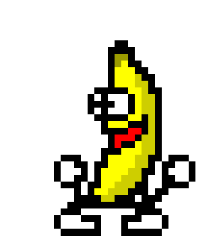
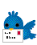

#  Quartocities 

This repository brings the beauty of
[geocities](https://geocities.restorativland.org/) to quarto!

Style your personal page as if it was the late 90's/early 2000's and go wild
with all those pretty gifs!

## Usage

simple clone/fork this repository and adapt at will. 
Most style aspects can be changed in `styles.css` and `geo.scss`. 

You can also check out the [demo]() for some inspiration. 

## Custom Shortcodes

### socials
`{}`  
`{}`  

add a gif that links to twitter/github profiles  

### Gif shortcodes
`{}`

display 3 mc hammer's dancing  

### Divider shortcodes

`{}`
horizontal divider gifs `(x=1...9)`

## Custom filters

### Under Construction
add `construction: true` to the yaml header of a page and a random (1 of 6)
"under construction" gifs is inserted on top of the page.

### Body backgrounds
change the background of the html body using the yaml parameter `body_bg`. Can
be set globally in `_quarto.yml` or locally in a file. The default is
`microfab`. other options can be found in the `img/bg` folder (dont use the file
ending, ie `body_bg: space`). You can of course also add your own background
gifs to the folder.

### Navbar backgrounds
In the same way, the background of the navbar can be changed with `nav_bg`. Here the default is `stars`.

### Title gif

Add a gif to the title of a page using the yaml parameter `title_gif`. Can be
set globally in `_quarto.yml` or locally in a file. default is to not display a
gif. The gif needs to be present in the `img/` folder (dont use the file ending,
ie `title_gif: banana-dance`). If you set a global gif you can unset it for
specific pages via `title-gif:none`.